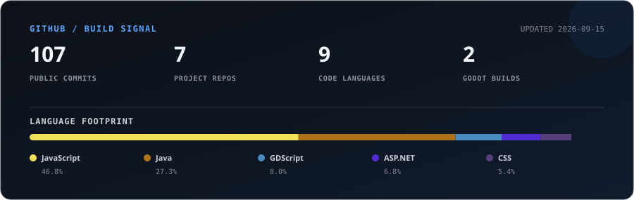

<div align="center">

<sub>SYSTEMS &nbsp; // &nbsp; GAMES &nbsp; // &nbsp; EXPERIMENTS</sub>

# Hey, I'm Mastergamerrrr.

### I build useful systems—and strange little worlds.

From student tools and community healthcare software to game-jam experiments,
I like turning complicated ideas into experiences people can actually use.

[](https://www.linkedin.com/in/labortejian/)
[](https://shadowlurkerrr.itch.io/)
[](https://github.com/Mastergamerrrr)

</div>

---

### What I'm building now

<table>
<tr>
<td width="66%" valign="top">

#### [PSITS CTU — student organization platform](https://github.com/Mastergamerrrr/PSITS_CTU_Main)

The digital home of the PSITS CTU student organization. It brings together the organization's identity, announcements, events, membership, resources, and contact information in one clear experience.

`React` `Vite` `Tailwind CSS` `Three.js`

</td>
<td width="34%" valign="top">

**Current focus**

`01` Student organization identity<br />
`02` Events and announcements<br />
`03` Membership and resources

</td>
</tr>
</table>

### Selected builds

<table>
<tr>
<td width="50%" valign="top">

#### 🩺 [Java E-Health System](https://github.com/Mastergamerrrr/JavaE-HealthSystem)

A clinic and barangay health-record system with role-based workflows, patient PDFs, QR generation, and QR scanning.

`Java` `JavaFX` `QR` `PDF`

</td>
<td width="50%" valign="top">

#### ⚔️ [Divine Intervention](https://github.com/Mastergamerrrr/Divine-Intervention)

My first game-jam project: a complete playable experiment built with Godot and shipped on itch.io.

`Godot` `GDScript` `Game Jam` · **[Play it →](https://shadowlurkerrr.itch.io/divine-intervention)**

</td>
</tr>
<tr>
<td width="50%" valign="top">

#### 🏦 [Aurelia](https://github.com/Mastergamerrrr/Aurelia_private)

A banking application exploring secure account flows, transactions, statements, and practical web-system architecture.

`C#` `.NET` `ASP.NET` `SQL`

</td>
<td width="50%" valign="top">

#### 🎣 [Ocean of Regrets](https://github.com/Mastergamerrrr/Ocean_of_Regrets)

A fishing-game experiment where mechanics, atmosphere, and a slightly mysterious ocean meet.

`Godot` `GDScript` `Game Design`

</td>
</tr>
</table>

### Tech stack

<table>
<tr>
<td><strong>Frontend</strong></td>
<td>
  
  
  
  
  
</td>
</tr>
<tr>
<td><strong>Systems</strong></td>
<td>
  
  
  
  
</td>
</tr>
<tr>
<td><strong>Game dev</strong></td>
<td>
  
  
</td>
</tr>
<tr>
<td><strong>Workflow</strong></td>
<td>
  
  
  
</td>
</tr>
</table>

### GitHub at a glance

<div align="center">



<sub>Refreshed daily from public GitHub data. Language percentages describe repository code, not proficiency.</sub>

</div>

### How I work

```text
find the real problem  →  make the flow understandable  →  build the smallest honest version  →  playtest  →  improve
```

I’m especially interested in projects where software has a visible effect: helping a student plan, helping a clinic find a record, or giving a player a world worth exploring.

---

<div align="center">

**Have an idea where practical software meets creative technology?**  
[Start a conversation on LinkedIn](https://www.linkedin.com/in/labortejian/) · [Explore my repositories](https://github.com/Mastergamerrrr?tab=repositories)

<sub>Built with curiosity, iteration, and an unreasonable number of side quests.</sub>

</div>
